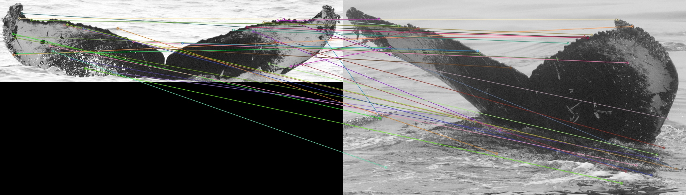
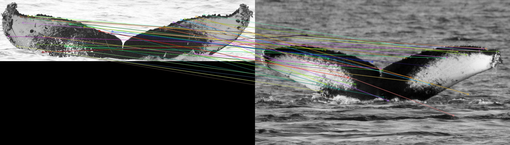

# HumpbackWhaleIdentification
The competition home is 
<a href=https://www.kaggle.com/c/humpback-whale-identification target="_blank">
https://www.kaggle.com/c/humpback-whale-identification
</a>
  
This is my note of what I do(or did) in this competiton. At first written in Japanese. And then written in English.  

## コンペ概要
クジラのしっぽ画像からクジラの種類を分類する画像分類コンペだった。特徴としては2万5千枚くらいの画像に対し、未分類的な扱いの
new_whaleが9000枚以上存在し、それ以外の最も画像が多い種類は96枚。2500種以上は画像がたった1枚しかないOne-Shot-Learningが必要なコンペ。

## コンペの結果
66/2131 で上位4％に入ることができた。初メダルの思い出深きコンペ。

## このコンペで重要だった技術
### Image Hash
同じ画像が複数紛れ込んでいたのでハッシュ化して同じものがあったら除外する方法が公開された。素晴らしい発想。下記Siamese Networkについても解説がある。
<a href=https://www.kaggle.com/martinpiotte/whale-recognition-model-with-score-0-78563 target="_blank">
https://www.kaggle.com/martinpiotte/whale-recognition-model-with-score-0-78563
</a>

### Siamese Network
One-Shot-Learning の代表例。2つのCNNを並列に並べて同じ画像であれば距離を近く、別の画像は遠くなるように学習する。
具体的には高次元空間にどうやって配置するか(どのように画像をベクトル化するか)を学習する。
lossはTriplet lossを使用した。これはアンカー画像を1枚用意し、アンカーと同じクラスなら近く、違うクラスなら遠くに配置するように学習するもの。
  
Courseraのdeeplearning.aiでとても分かりやすく説明されている。
上記を組み合わせた<a href=https://www.kaggle.com/seesee/siamese-pretrained-0-822 target="_blank">
このkernel
</a>
をメインにして、lap を lapjvに変更し、Colabで実行するように変更(毎回重みをクラウドストレージに退避する処理を追加)
したモデルが一番良かった。

## その他試したこと
### ArcFaceLoss
顔認証で使われるloss画像の類似度を距離でなくcos類似度で測る。うまくいくと思ったのだが前処理で間違えていたため精度が出なかった。
loss自体は
<a href=https://gist.github.com/koshian2/d28a3cbdfc8f398f7d836739dbc6b5b2 target="_blank">
こちら
</a>
を参考にした。(精度が出なかったのは前処理の問題なので、こちらの問題ではないです)
  
試さなかったが、MXNETの
<a href=https://github.com/deepinsight/insightface target="_blank">
顔認識の学習済みモデル
</a>
を使う方法も検討した。下記前処理・ラベル付けが必要だったため見送った。
  
①画像から顔(今回であればクジラの尻尾)のみ切り出し、中央に配置する
  
②目・目・鼻・口の端・口の端にアノテーションする。(クジラだったら尻尾の端と繋ぎ目と...？)
  
①も②も人間の顔を使って学習済みのデータがあるみたいで、人間の顔認証したい場合は単純に画像だけ集めて指定された通りのディレクトリ構成で画像を格納すればよさそうだった。
### AffinityLoss
<a href=https://arxiv.org/abs/1901.07711 target="_blank">
https://arxiv.org/abs/1901.07711
</a>
  
不均衡データの分類に対するloss関数。コンペ終了約1ヶ月前に出た論文で、モデルへの適用が間に合わなかった。。。実装された方がいるので
<a href=https://github.com/koshian2/affinity-loss target="_blank">
こちら
</a>
を参考にする予定

### Siamese Network の出力ベクトルをLightGBMで学習(全くダメ)
学習済み画像群から得られるベクトルと、テスト用画像群から得られるベクトルがだいぶ違ったのか、evalは90%台だったがテスト用画像群にあてはめたら
全て固定値で返ってきた。。。
  
ただ、PCAの次元削減、LightGBMとOptunaによるチューニングが身についたから良しとする。

### AKAZEによる特徴点抽出
SIFTがよさそうだったが特許とられているのでAKAZEを用いて画像の特徴点を抽出し個数か何かで分類できないか試した。
同一クラスと別クラスでそれほど特徴点の個数に差が出なかったのと閾値でかなり特徴点の個数が変わってしまったので、調整が大変そうなので見送った。
同じクラス
  
別のクラス
  
<a href=https://github.com/MagicLeapResearch/SuperPointPretrainedNetwork target="_blank">
SuperPoint
</a>
も試してみたが、デモ用ファイルが動画の直前フレームとの特徴点差分を見るもので、全く違う画像では扱えなかったため変更にかかる時間を考慮し見送った。

### OCR
コンペの主催者は望まない方法だと思うが、一部画像にクジラのIDが記載されていた(コンペの分類IDとは異なるが)。この文字を読み取りヒントにするため、
TextDetectionとTextRecognitionを試した(Tesseract使っただけだけど)
